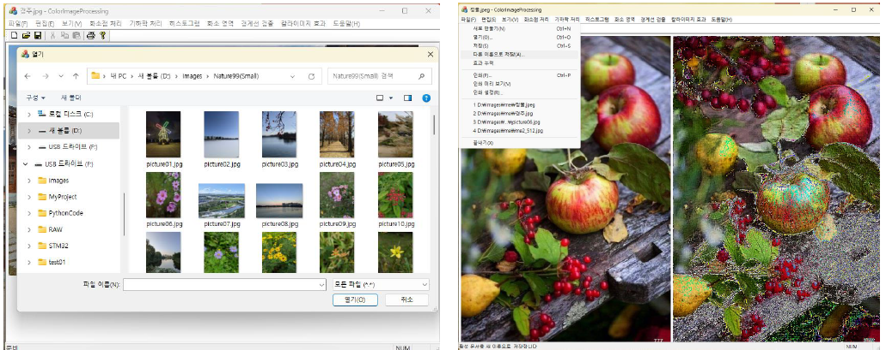

# Color Image Processing 

## Purpose
- Open CV 없이 MFC로 구현한 C++ Image Processing  

## Development Environment
- Windows 11 
- Visual Studio Community 2022, C++(MFC)

## Function
- 파일 : 열기, 저장 , 효과 누적
- 화소점 처리  
  기하학 처리  
  칼라 이미지 효과  
  화소 영역 처리 
  경계선 검출  

  

